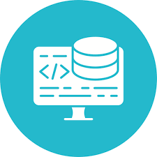
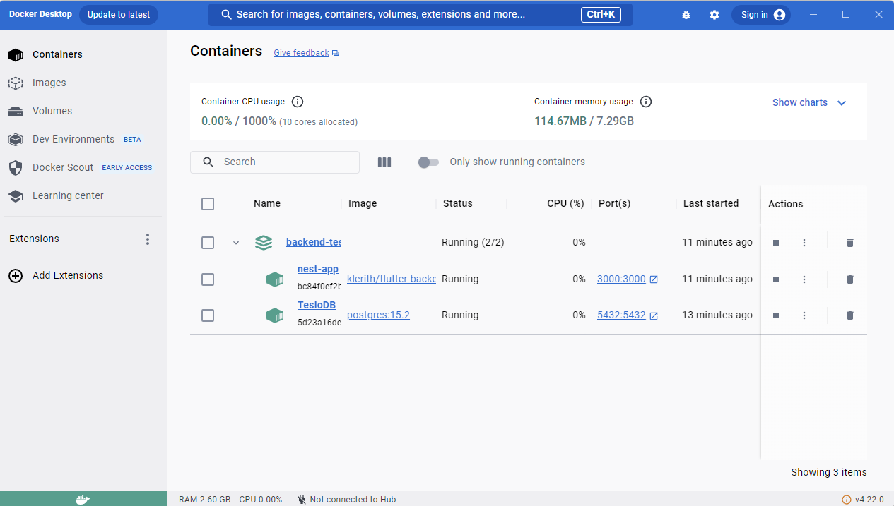
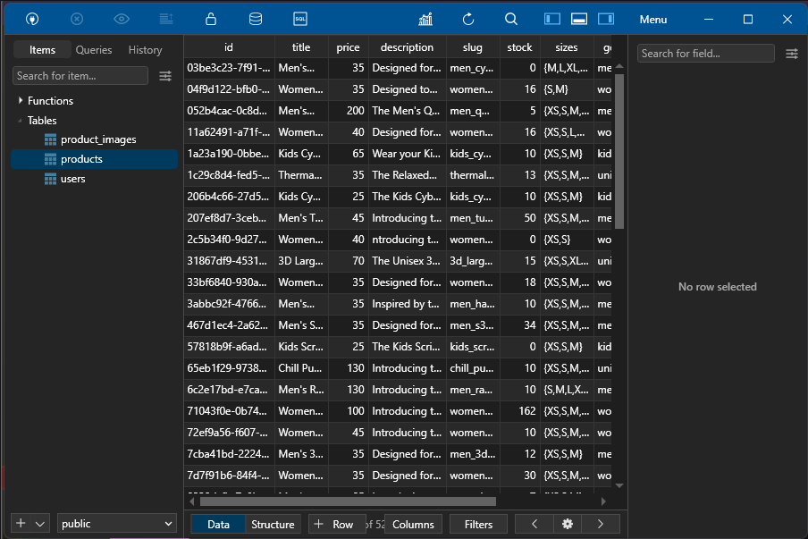
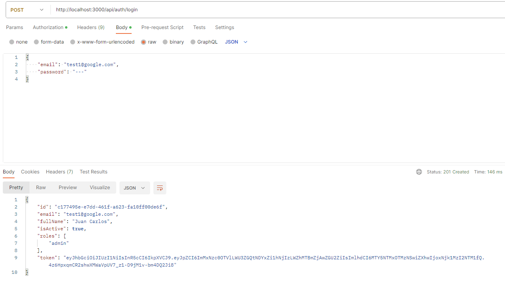
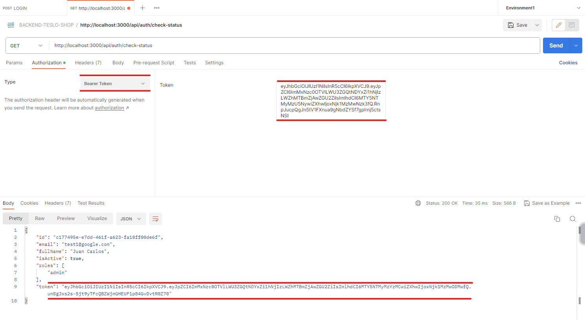
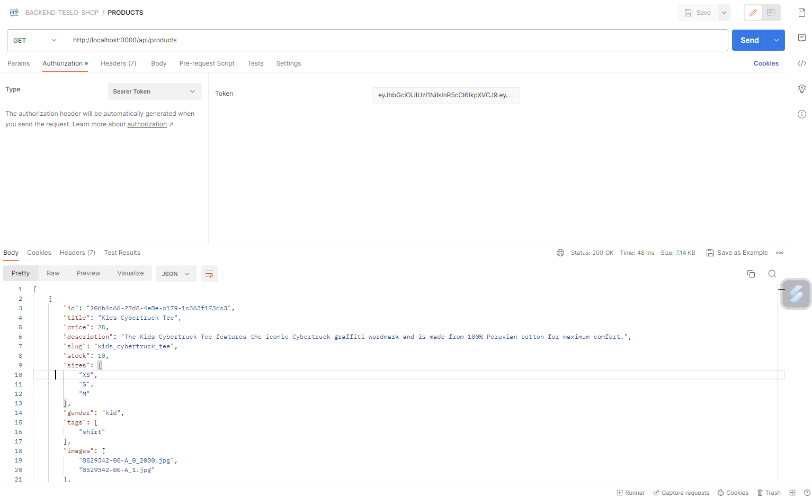
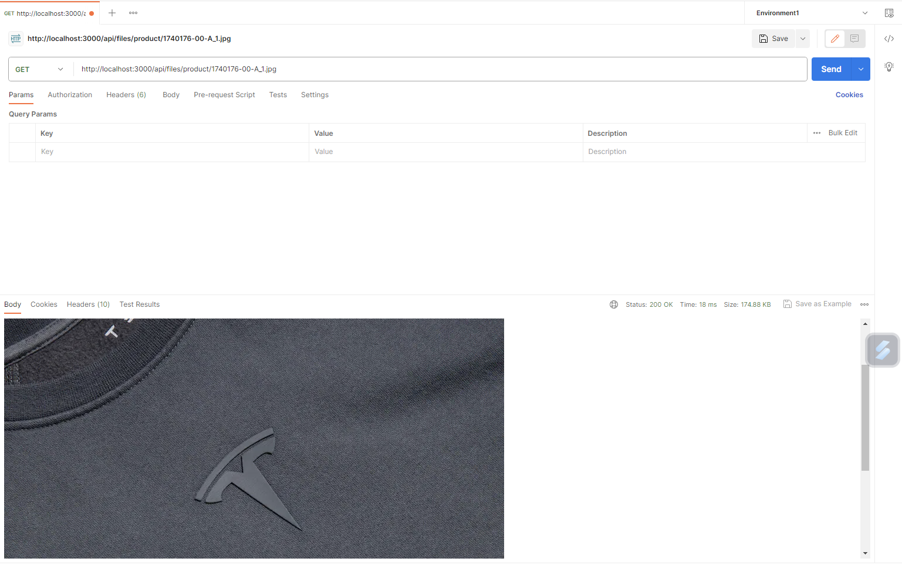
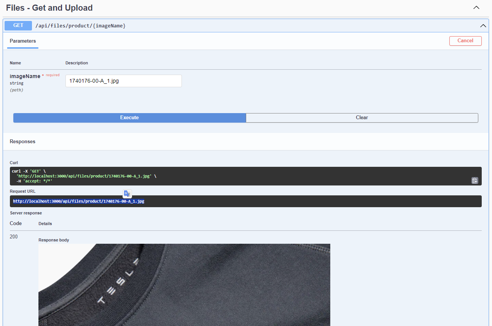

# TesloShop Backend

El objetivo de este proyecto es mostrar el montaje de un backend para facilitar las operaciones en un entorno de trabajo real.

## Implementaciones 🛠️

* Docker

* Docker compose

* Imágenes de docker

* Conectarse a postgres usando TablePlus

* Probar el backend configurado

* Llenar la base de datos

* Leer la documentación del backend

* Generar JWTs y probarlos

* Uso de bearer tokens en los headers de autenticación

* Trabajar las pruebas con Postman

El objetivo es trabajar lo más apegado a la realidad posible, como si se nos pidiera posteriormente el desarrollo de la aplicación móvil, conectándose a ese backend, que es literal el backend usado en producción, pero con una base de datos y variables de entorno diferentes.

Para ello, primero creamos nuestra base de datos con Docker



Después ejecutamos el endpoint para crear los seeders y podemos checkear la creación de los datos con TablePlus



## Probando los endpoints en Postman y Swagger 🚀

**Login**


**Status**


**Products**


**ProductsId**


**Swagger**



## Desarrollo 🔩

1. Tener activo el servicio de Docker (Docker Desktop o Docker Deamon)
2. Clonar el archivo __.env.template__ y renombrar la copia a __.env__
3. Levantar los servicios con el comando
```
docker compose up -d
```
4. Llenar la base de datos con data temporal:

    http://localhost:3000/api/seed

5. Documentación de los endpoints disponibles:

    http://localhost:3000/api

## Tecnología 🖥️

[Docker](https://www.docker.com/) ||
[TablePlus](https://tableplus.com/) || [Postman](https://www.postman.com/) || [Swagger](https://swagger.io/)

## Recursos 📚

[udemy](https://www.udemy.com/)

## Autor ✒️

- **Jose Llanas** - [jllanas1986](https://github.com/jllanas1986)
